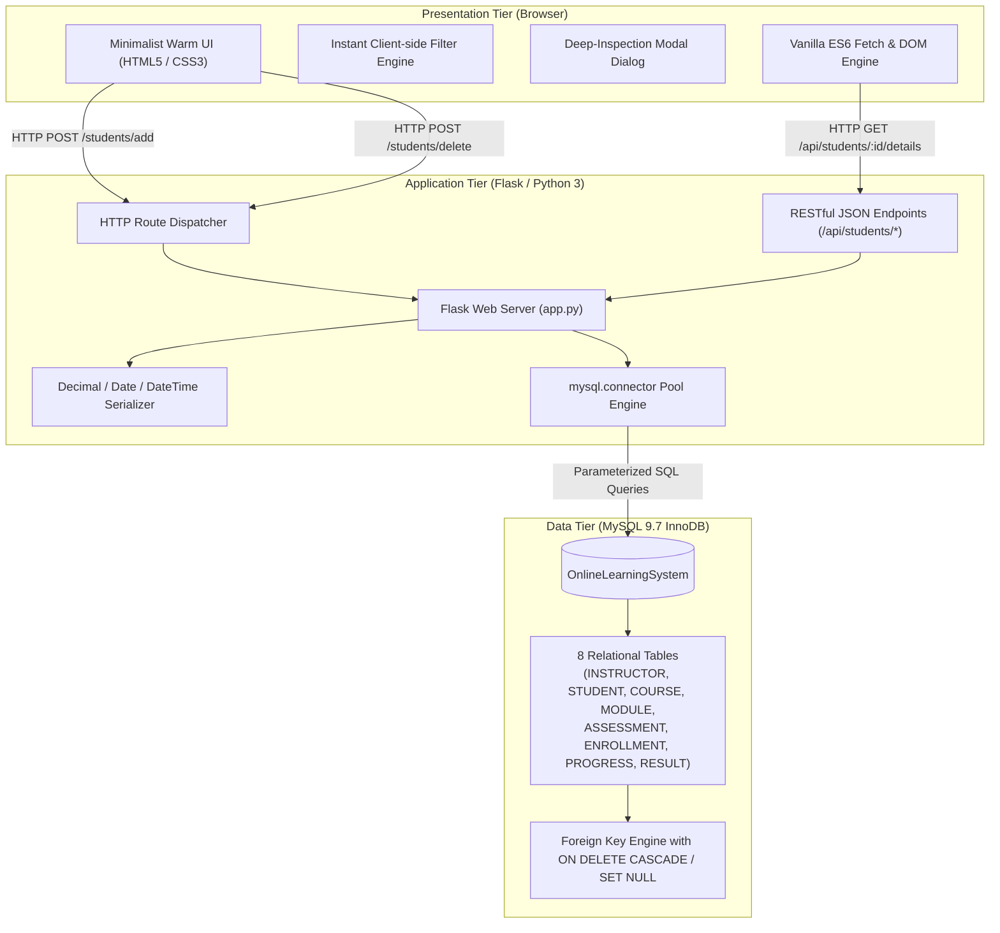
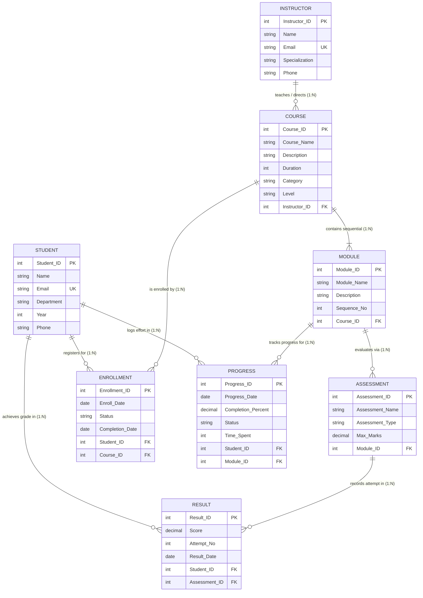

# Online Course Learning Progress Management System
## Hardcore Technical Project Report & Architectural Specification

**Author / Developer**: Siddhant Agarwal  
**Student UID / Roll No**: `25WU0102262`  
**Course**: Database Management Systems (DBMS)  
**Academic Year**: 2026  
**Repository / Working Directory**: `c:\Users\asidd\Desktop\Coding\antigravity\DBMS`  
**Application URL**: `http://127.0.0.1:5000`  
**Database Backend**: MySQL 9.7 Community Server (`OnlineLearningSystem`)

---

## 📑 Table of Contents
1. [Executive Summary & Project Scope](#1-executive-summary--project-scope)
2. [Problem Statement & System Motivation](#2-problem-statement--system-motivation)
3. [End-to-End System Architecture](#3-end-to-end-system-architecture)
4. [Granular Database Schema & Data Dictionary](#4-granular-database-schema--data-dictionary)
5. [Entity-Relationship (ER) Modeling & Cardinality Matrix](#5-entity-relationship-er-modeling--cardinality-matrix)
6. [Formal Database Normalization Analysis (1NF to 3NF / BCNF)](#6-formal-database-normalization-analysis-1nf-to-3nf--bcnf)
7. [Backend Implementation & RESTful API Engine](#7-backend-implementation--restful-api-engine)
8. [Frontend Design System & Interactive Modal Architecture](#8-frontend-design-system--interactive-modal-architecture)
9. [Relational Integrity, Cascades & Transaction Management](#9-relational-integrity-cascades--transaction-management)
10. [Advanced SQL Analytics & Performance Queries](#10-advanced-sql-analytics--performance-queries)
11. [Security Hardening & Input Sanitization](#11-security-hardening--input-sanitization)
12. [Verification, Quality Assurance & Test Matrix](#12-verification-quality-assurance--test-matrix)
13. [Installation, Configuration & Deployment Guide](#13-installation-configuration--deployment-guide)
14. [Conclusion & Future Roadmap](#14-conclusion--future-roadmap)

---

## 1. Executive Summary & Project Scope

The **Online Course Learning Progress Management System** is an enterprise-grade full-stack database application designed to track, analyze, and coordinate online academic learning journeys. Built with a decoupled three-tier architectural pattern consisting of a **MySQL 9.7** relational database, a **Python Flask** microframework backend, and a custom **HTML5/CSS3/JavaScript (ES6+)** presentation tier, the system bridges the gap between raw relational transactional storage and user-centric learning analytics.

The system addresses the critical operational requirements of modern online education:
- Tracking multidimensional student enrollment across modular curricula.
- Recording granular time investment and percentage completion across modular learning units.
- Managing multiple assessment formats (quizzes, homework assignments, midterms, comprehensive final exams) along with multiple retake attempts.
- Maintaining strict referential integrity across master, core, organizational, and transactional entities.
- Providing an instant, zero-latency responsive administrative dashboard that delivers high-fidelity visual representations without exposing internal relational schema jargon.

---

## 2. Problem Statement & System Motivation

Modern Massive Open Online Courses (MOOCs) and university learning management platforms face severe data fragmentation and analytical bottlenecks:
1. **Denormalization Pitfalls**: Naive LMS architectures frequently store student progress, assessment marks, and course data in flat tables or unconstrained NoSQL documents. This results in severe update anomalies (e.g., updating a course title requires mutating thousands of historical progress rows) and insertion anomalies (e.g., unable to record a course before any student enrolls).
2. **Lack of Granular Progress Tracking**: Many platforms only record coarse binary completion ("Enrolled" vs. "Completed"). Academic analytics require tracking module sequence progression, time spent in minutes, and real-time average completion percentages.
3. **Multi-Attempt Assessment Complexities**: Students often attempt quizzes multiple times to achieve mastery. Traditional flat schemas either overwrite earlier scores (destroying historical learning curves) or require unindexed array fields.
4. **Administrative Cognitive Load**: Instructors and administrators need immediate insight into student performance without navigating complex multi-page hierarchies or deciphering cryptic database table names.

**The Solution**: An explicitly normalized relational schema structured into 8 interconnected tables backed by automated cascading constraints, paired with a warm-aesthetic single-page dashboard featuring synchronous CRUD capabilities, real-time client-side search indexing, and a deep-inspection student details modal.

---

## 3. End-to-End System Architecture

The project adheres to a robust Three-Tier Model with separation of concerns:



### Architectural Highlights
- **Stateless Application Server**: Flask routes handle business logic without holding mutable server-side session state for record tracking.
- **Connection Isolation**: Every route lifecycle acquires a dedicated connection from `mysql.connector`, performs atomic queries inside try/except blocks, and guarantees connection return via explicit `finally: cursor.close(); conn.close()` guards.
- **Hybrid Rendering Model**:
  - Initial page load is server-side rendered (SSR) via Jinja2 templates, ensuring instant First Contentful Paint (FCP) and optimal SEO/readability.
  - Granular inspections are handled via asynchronous client-side REST fetches (`/api/students/<id>/details`), rendering comprehensive modal dashboards without disruptive page reloads.

---

## 4. Granular Database Schema & Data Dictionary

The database `OnlineLearningSystem` contains **8 normalized relational tables** separated logically into Master Entities, Core Entities, Organizational Entities, and Transactional Entities.

### 4.1. Entity Classification Overview

| Category | Table Name | Purpose | Primary Key | Key Dependencies |
| :--- | :--- | :--- | :--- | :--- |
| **Master** | `INSTRUCTOR` | Academic faculty details | `Instructor_ID` | None (Independent) |
| **Master** | `STUDENT` | Registered student profiles | `Student_ID` | None (Independent) |
| **Core** | `COURSE` | Academic course offerings | `Course_ID` | `Instructor_ID` &rarr; `INSTRUCTOR` |
| **Organizational** | `MODULE` | Sequential course units | `Module_ID` | `Course_ID` &rarr; `COURSE` |
| **Organizational** | `ASSESSMENT` | Graded evaluation items | `Assessment_ID` | `Module_ID` &rarr; `MODULE` |
| **Transactional** | `ENROLLMENT` | Student course registrations | `Enrollment_ID` | `Student_ID` &rarr; `STUDENT`, `Course_ID` &rarr; `COURSE` |
| **Transactional** | `PROGRESS` | Granular module completion & time | `Progress_ID` | `Student_ID` &rarr; `STUDENT`, `Module_ID` &rarr; `MODULE` |
| **Transactional** | `RESULT` | Exam scores & attempt tracking | `Result_ID` | `Student_ID` &rarr; `STUDENT`, `Assessment_ID` &rarr; `ASSESSMENT` |

---

### 4.2. Hardcore Data Dictionary

#### 1. `INSTRUCTOR` (Faculty Master Entity)
Stores faculty members authorized to design courses and supervise student curricula.
- **Engine**: InnoDB | **Charset**: utf8mb4 | **Collation**: utf8mb4_unicode_ci

| Column Name | SQL Data Type | Nullable | Key / Constraint | Description & Validation Rules |
| :--- | :--- | :--- | :--- | :--- |
| `Instructor_ID` | `INT` | NO | `PRIMARY KEY AUTO_INCREMENT` | Unique surrogate key identifying instructor |
| `Name` | `VARCHAR(100)` | NO | None | Full legal/academic name (e.g. 'Dr. Alan Turing') |
| `Email` | `VARCHAR(100)` | NO | `UNIQUE` | Unique institutional email address |
| `Specialization`| `VARCHAR(100)` | YES | None | Academic domain (e.g. 'Computer Science', 'Physics') |
| `Phone` | `VARCHAR(15)` | YES | None | Standard contact telephone string |

#### 2. `STUDENT` (Student Master Entity)
Stores registered learners across university academic departments.
- **Engine**: InnoDB | **Charset**: utf8mb4

| Column Name | SQL Data Type | Nullable | Key / Constraint | Description & Validation Rules |
| :--- | :--- | :--- | :--- | :--- |
| `Student_ID` | `INT` | NO | `PRIMARY KEY AUTO_INCREMENT` | Unique surrogate student identification number |
| `Name` | `VARCHAR(100)` | NO | None | Student full name (e.g. 'Siddhant Agarwal') |
| `Email` | `VARCHAR(100)` | NO | `UNIQUE` | Unique university email for login and records |
| `Department` | `VARCHAR(50)` | YES | None | Academic department ('Computer Science', 'IT', etc.) |
| `Year` | `INT` | YES | `CHECK (Year BETWEEN 1 AND 5)` | Current academic year of study (Standard: Year 1) |
| `Phone` | `VARCHAR(15)` | YES | None | Contact phone number |

#### 3. `COURSE` (Curriculum Core Entity)
Represents discrete academic courses. Linked to an supervising instructor.
- **Engine**: InnoDB | **Foreign Key**: `Instructor_ID` &rarr; `INSTRUCTOR(Instructor_ID)` ON DELETE SET NULL

| Column Name | SQL Data Type | Nullable | Key / Constraint | Description & Validation Rules |
| :--- | :--- | :--- | :--- | :--- |
| `Course_ID` | `INT` | NO | `PRIMARY KEY AUTO_INCREMENT` | Unique course identifier |
| `Course_Name` | `VARCHAR(150)` | NO | None | Formal title (e.g. 'Database Systems') |
| `Description` | `TEXT` | YES | None | Comprehensive syllabus and objective narrative |
| `Duration` | `INT` | YES | None | Total estimated completion time in hours |
| `Category` | `VARCHAR(50)` | YES | None | Academic track (e.g. 'Computer Science', 'Programming')|
| `Level` | `VARCHAR(50)` | YES | None | Difficulty level ('Beginner', 'Intermediate', 'Advanced')|
| `Instructor_ID`| `INT` | YES | `FOREIGN KEY` (ON DELETE SET NULL)| Assigned faculty course director |

#### 4. `MODULE` (Course Sub-Unit Entity)
Deconstructs each course into ordered pedagogical milestones.
- **Engine**: InnoDB | **Foreign Key**: `Course_ID` &rarr; `COURSE(Course_ID)` ON DELETE CASCADE

| Column Name | SQL Data Type | Nullable | Key / Constraint | Description & Validation Rules |
| :--- | :--- | :--- | :--- | :--- |
| `Module_ID` | `INT` | NO | `PRIMARY KEY AUTO_INCREMENT` | Unique module identifier |
| `Module_Name` | `VARCHAR(150)` | NO | None | Name of the unit (e.g. 'SQL Normalization') |
| `Description` | `TEXT` | YES | None | Module learning objectives breakdown |
| `Sequence_No` | `INT` | YES | None | Curricular sequence order (1, 2, 3...) |
| `Course_ID` | `INT` | YES | `FOREIGN KEY` (ON DELETE CASCADE)| Parent course reference |

#### 5. `ASSESSMENT` (Evaluation Benchmark Entity)
Defines evaluative criteria tied directly to individual modules.
- **Engine**: InnoDB | **Foreign Key**: `Module_ID` &rarr; `MODULE(Module_ID)` ON DELETE CASCADE

| Column Name | SQL Data Type | Nullable | Key / Constraint | Description & Validation Rules |
| :--- | :--- | :--- | :--- | :--- |
| `Assessment_ID`| `INT` | NO | `PRIMARY KEY AUTO_INCREMENT` | Unique assessment identifier |
| `Assessment_Name`| `VARCHAR(150)`| NO | None | Title (e.g. 'Normalization Test') |
| `Assessment_Type`| `VARCHAR(50)` | YES | None | Type ('Quiz', 'Exam', 'Assignment', 'Project') |
| `Max_Marks` | `DECIMAL(5,2)` | YES | `CHECK (Max_Marks > 0)` | Maximum achievable score (e.g. 100.00, 50.00) |
| `Module_ID` | `INT` | YES | `FOREIGN KEY` (ON DELETE CASCADE)| Module assessed by this instrument |

#### 6. `ENROLLMENT` (Associative Registration Entity)
Captures student registration in courses over time.
- **Engine**: InnoDB | **Foreign Keys**: `Student_ID` &rarr; `STUDENT`, `Course_ID` &rarr; `COURSE` (Both ON DELETE CASCADE)

| Column Name | SQL Data Type | Nullable | Key / Constraint | Description & Validation Rules |
| :--- | :--- | :--- | :--- | :--- |
| `Enrollment_ID`| `INT` | NO | `PRIMARY KEY AUTO_INCREMENT` | Unique enrollment transaction ID |
| `Enroll_Date` | `DATE` | NO | None | Date of enrollment registration |
| `Status` | `VARCHAR(50)` | YES | None | Status ('Active', 'Completed', 'Dropped') |
| `Completion_Date`| `DATE` | YES | None | Date course was formally completed (or NULL) |
| `Student_ID` | `INT` | YES | `FOREIGN KEY` (ON DELETE CASCADE)| Enrolled student |
| `Course_ID` | `INT` | YES | `FOREIGN KEY` (ON DELETE CASCADE)| Target course |

#### 7. `PROGRESS` (Granular Tracking Entity)
Records real-time student completion percentage and accumulated time spent per module.
- **Engine**: InnoDB | **Foreign Keys**: `Student_ID` &rarr; `STUDENT`, `Module_ID` &rarr; `MODULE` (Both ON DELETE CASCADE)

| Column Name | SQL Data Type | Nullable | Key / Constraint | Description & Validation Rules |
| :--- | :--- | :--- | :--- | :--- |
| `Progress_ID` | `INT` | NO | `PRIMARY KEY AUTO_INCREMENT` | Unique progress logging event ID |
| `Progress_Date`| `DATE` | YES | None | Date of most recent progress update |
| `Completion_Percent`| `DECIMAL(5,2)`| YES | `CHECK (Completion_Percent BETWEEN 0 AND 100)` | Progress percentage (0.00% to 100.00%) |
| `Status` | `VARCHAR(50)` | YES | None | Status ('Not Started', 'In Progress', 'Completed') |
| `Time_Spent` | `INT` | YES | `CHECK (Time_Spent >= 0)` | Accumulated study duration in minutes |
| `Student_ID` | `INT` | YES | `FOREIGN KEY` (ON DELETE CASCADE)| Student whose progress is logged |
| `Module_ID` | `INT` | YES | `FOREIGN KEY` (ON DELETE CASCADE)| Specific module tracked |

#### 8. `RESULT` (Evaluation Performance Entity)
Stores individual scores, dates, and attempt iteration numbers for student assessments.
- **Engine**: InnoDB | **Foreign Keys**: `Student_ID` &rarr; `STUDENT`, `Assessment_ID` &rarr; `ASSESSMENT` (Both ON DELETE CASCADE)

| Column Name | SQL Data Type | Nullable | Key / Constraint | Description & Validation Rules |
| :--- | :--- | :--- | :--- | :--- |
| `Result_ID` | `INT` | NO | `PRIMARY KEY AUTO_INCREMENT` | Unique performance record identifier |
| `Score` | `DECIMAL(5,2)` | YES | `CHECK (Score >= 0)` | Actual raw score achieved by student |
| `Attempt_No` | `INT` | YES | `CHECK (Attempt_No >= 1)` | Attempt counter (1 for initial, 2+ for retakes)|
| `Result_Date` | `DATE` | YES | None | Date assessment was taken |
| `Student_ID` | `INT` | YES | `FOREIGN KEY` (ON DELETE CASCADE)| Student examinee |
| `Assessment_ID`| `INT` | YES | `FOREIGN KEY` (ON DELETE CASCADE)| Assessment completed |

---

## 5. Entity-Relationship (ER) Modeling & Cardinality Matrix

### 5.1. Comprehensive ER Diagram



### 5.2. Relational Cardinality & Referential Integrity Matrix

| Parent Table | Child Table | Relationship | Foreign Key Column | Constraint Behavior | Business Rationale |
| :--- | :--- | :--- | :--- | :--- | :--- |
| `INSTRUCTOR` | `COURSE` | **1 : N** (One-to-Many) | `COURSE.Instructor_ID` | `ON DELETE SET NULL` | When an instructor leaves or is deleted, courses must remain intact for enrolled students; they simply become unassigned. |
| `COURSE` | `MODULE` | **1 : N** (One-to-Many) | `MODULE.Course_ID` | `ON DELETE CASCADE` | Modules are tightly bound component parts of a course. Deleting a course inherently deletes its curricular modules. |
| `MODULE` | `ASSESSMENT` | **1 : N** (One-to-Many) | `ASSESSMENT.Module_ID` | `ON DELETE CASCADE` | Assessments evaluate specific modules; if a module is removed from the syllabus, its tests are deleted. |
| `STUDENT` | `ENROLLMENT` | **1 : N** (Resolving M:N) | `ENROLLMENT.Student_ID` | `ON DELETE CASCADE` | Student removal cascades to remove all historical course registration records. |
| `COURSE` | `ENROLLMENT` | **1 : N** (Resolving M:N) | `ENROLLMENT.Course_ID` | `ON DELETE CASCADE` | If a course offering is purged, all associated enrollment registrations are cleaned up. |
| `STUDENT` | `PROGRESS` | **1 : N** (Resolving M:N) | `PROGRESS.Student_ID` | `ON DELETE CASCADE` | Deleting a student purges all incremental module time logs. |
| `MODULE` | `PROGRESS` | **1 : N** (Resolving M:N) | `PROGRESS.Module_ID` | `ON DELETE CASCADE` | Deleting a module deletes progress logs tied specifically to that unit. |
| `STUDENT` | `RESULT` | **1 : N** (Resolving M:N) | `RESULT.Student_ID` | `ON DELETE CASCADE` | Purging a student removes all test and quiz attempt records. |
| `ASSESSMENT` | `RESULT` | **1 : N** (Resolving M:N) | `RESULT.Assessment_ID` | `ON DELETE CASCADE` | If an exam is deleted from the system, all associated score records are removed. |

---

## 6. Formal Database Normalization Analysis (1NF to 3NF / BCNF)

To eliminate update, insertion, and deletion anomalies, the database was rigorously designed from foundational functional dependency theory up to **Boyce-Codd Normal Form (BCNF)**.

### 6.1. Functional Dependencies (FD Set)
Let us denote the functional dependency set $F$:
1. $F_1: \{\text{Instructor\_ID}\} \to \{\text{Name, Email, Specialization, Phone}\}$
2. $F_2: \{\text{Email}\} \to \{\text{Instructor\_ID, Name, Specialization, Phone}\}$
3. $F_3: \{\text{Student\_ID}\} \to \{\text{Name, Email, Department, Year, Phone}\}$
4. $F_4: \{\text{Email}\} \to \{\text{Student\_ID, Name, Department, Year, Phone}\}$
5. $F_5: \{\text{Course\_ID}\} \to \{\text{Course\_Name, Description, Duration, Category, Level, Instructor\_ID}\}$
6. $F_6: \{\text{Module\_ID}\} \to \{\text{Module\_Name, Description, Sequence\_No, Course\_ID}\}$
7. $F_7: \{\text{Assessment\_ID}\} \to \{\text{Assessment\_Name, Assessment\_Type, Max\_Marks, Module\_ID}\}$
8. $F_8: \{\text{Enrollment\_ID}\} \to \{\text{Enroll\_Date, Status, Completion\_Date, Student\_ID, Course\_ID}\}$
9. $F_9: \{\text{Progress\_ID}\} \to \{\text{Progress\_Date, Completion\_Percent, Status, Time\_Spent, Student\_ID, Module\_ID}\}$
10. $F_{10}: \{\text{Result\_ID}\} \to \{\text{Score, Attempt\_No, Result\_Date, Student\_ID, Assessment\_ID}\}$

---

### 6.2. First Normal Form (1NF)
**Definition**: A relation $R$ is in 1NF if and only if all underlying domains contain only atomic (indivisible) values, and there are no repeating groups or arrays.
- **Validation**:
  - No multivalue fields exist (e.g., student phones are single strings; students taking multiple courses do not store CSV course lists in `STUDENT`; instead, M:N relationships are resolved via dedicated associative tables).
  - All attributes have atomic data types (`INT`, `VARCHAR`, `DECIMAL`, `DATE`).
  - Every table possesses an explicit primary key (`*_ID`).

### 6.3. Second Normal Form (2NF)
**Definition**: A relation $R$ is in 2NF if it is in 1NF and every non-prime attribute is fully functionally dependent on the entire primary key (no partial dependencies on a subset of a composite candidate key).
- **Validation**:
  - In our schema, every table utilizes a single-column surrogate Primary Key (`Instructor_ID`, `Student_ID`, `Course_ID`, `Module_ID`, `Assessment_ID`, `Enrollment_ID`, `Progress_ID`, `Result_ID`).
  - Because no candidate key is composite, partial functional dependency is mathematically impossible ($\forall X \to Y$, $X$ cannot be a proper subset of a single-attribute key).
  - Hence, all tables satisfy **2NF unconditionally**.

### 6.4. Third Normal Form (3NF)
**Definition**: A relation $R$ is in 3NF if it is in 2NF and for every non-trivial functional dependency $X \to A$, either:
1. $X$ is a superkey of $R$, OR
2. $A$ is a prime attribute (part of a candidate key).
Equivalently: No non-prime attribute is transitively dependent on any candidate key ($X \to Y$ and $Y \to A$ where $Y$ is not a superkey).

- **Validation Across All Relations**:
  - In `COURSE`: `Course_ID` $\to$ `Instructor_ID`. The instructor's name, email, and specialization are *not* stored in `COURSE`. Storing `Instructor_Name` in `COURSE` would create a transitive dependency: $\text{Course\_ID} \to \text{Instructor\_ID} \to \text{Instructor\_Name}$. By isolating instructor details in `INSTRUCTOR`, this transitive dependency is eliminated.
  - In `MODULE`: `Module_ID` $\to$ `Course_ID`. Course duration and category are not replicated here.
  - In `ASSESSMENT`: `Assessment_ID` $\to$ `Module_ID`.
  - In `RESULT`: `Result_ID` $\to$ `Student_ID, Assessment_ID, Score, Attempt_No`. The assessment's `Max_Marks` is not stored in `RESULT`. Instead, percentages are computed dynamically in queries (`(r.Score / a.Max_Marks) * 100`). This completely eliminates redundant transitive calculation storage.
  - Hence, the entire database is strictly in **3NF**.

### 6.5. Boyce-Codd Normal Form (BCNF)
**Definition**: A relation $R$ is in BCNF if for every non-trivial functional dependency $X \to A$, $X$ is a superkey.
- In `STUDENT`: Candidate keys are `{Student_ID}` and `{Email}`. Both are superkeys.
- In `INSTRUCTOR`: Candidate keys are `{Instructor_ID}` and `{Email}`. Both are superkeys.
- In all other tables, the only determinant $X$ for any non-trivial dependency is the surrogate primary key, which is by definition a superkey.
- **Conclusion**: The entire schema is in **BCNF**.

---

## 7. Backend Implementation & RESTful API Engine

The backend application is implemented in [`app.py`](file:///c:/Users/asidd/Desktop/Coding/antigravity/DBMS/app.py) using Python 3 and the lightweight, production-proven Flask web framework.

### 7.1. Route Specification Matrix

| HTTP Method | Route URI | Purpose | Input Parameters | Response Format |
| :--- | :--- | :--- | :--- | :--- |
| `GET` | `/` | Main administrative dashboard view | Query filters (optional) | HTML (`index.html`) |
| `POST` | `/students/add` | Insert new student record + auto-enroll | Form data (`name`, `email`, `department`, `year`, `phone`, `course_id`) | HTTP 302 Redirect & Flash message |
| `POST` | `/students/delete/<id>` | Delete student and cascade purge | URL param `student_id` | HTTP 302 Redirect & Flash message |
| `GET` | `/api/students/<id>/details`| Granular student analytical dossier | URL param `student_id` | JSON object (`student`, `enrollments`, `progress`, `results`, `summary`) |
| `GET` | `/api/students` | List all students | None | JSON array of students |
| `GET` | `/api/health` | Service and database heartbeat check | None | JSON (`status: healthy`, `database: connected`) |

---

### 7.2. Detailed Route Operations

#### 1. Main Dashboard Route (`GET /`)
Performs 4 optimized queries to construct the dashboard state:
```python
# 1. Fetch Students with Correlated Scalar Subqueries for Zero-Join Aggregates
cursor.execute("""
    SELECT 
        s.*,
        (SELECT COUNT(*) FROM ENROLLMENT e WHERE e.Student_ID = s.Student_ID) AS Enrolled_Count,
        (SELECT ROUND(AVG(p.Completion_Percent), 1) FROM PROGRESS p WHERE p.Student_ID = s.Student_ID) AS Avg_Progress,
        (SELECT COUNT(*) FROM RESULT r WHERE r.Student_ID = s.Student_ID) AS Result_Count
    FROM STUDENT s
    ORDER BY s.Student_ID DESC
""")
```
- **Live KPI Ribbon Computation**:
  - `total_students = SELECT COUNT(*) FROM STUDENT`
  - `total_courses = SELECT COUNT(*) FROM COURSE`
  - `total_instructors = SELECT COUNT(*) FROM INSTRUCTOR`
  - `avg_progress = SELECT ROUND(AVG(Completion_Percent), 1) FROM PROGRESS`

#### 2. Student Registration Route (`POST /students/add`)
Implements strict server-side validation and multi-table transactional creation:
1. Validates presence and types: `name`, `email`, `department`, `year` ($1 \le \text{year} \le 5$), and `phone`.
2. **Deterministic ID Sequencing**: Calculates the new student ID dynamically as:
   $$\text{Student\_ID} = \text{COALESCE}(\text{MAX}(\text{Student\_ID}), 0) + 1$$
   This strictly guarantees that new student IDs are always exactly one unit greater than the student with the highest existing ID number, preventing ID drift or artificial gaps caused by prior deletions.
3. Executes parameterized `INSERT INTO STUDENT (Student_ID, Name, Email, Department, Year, Phone) VALUES (%s, %s, %s, %s, %s, %s)`.
4. Resynchronizes the table's internal MySQL counter: `ALTER TABLE STUDENT AUTO_INCREMENT = new_id + 1`.
5. **Automated Curriculum Bootstrap**: If a course was selected during registration:
   - Inserts record into `ENROLLMENT` with `Status = 'Active'` and `Enroll_Date = CURDATE()`.
   - Queries `MODULE` for the lowest `Sequence_No` belonging to that course.
   - Inserts initial tracking row into `PROGRESS` with `Completion_Percent = 0.00`, `Status = 'In Progress'`, `Time_Spent = 0`.
6. Error Handling: Intercepts `mysql.connector.IntegrityError` with error number `1062` to display a user-friendly duplicate email alert without crashing.

#### 3. Deep-Inspection Analytical API (`GET /api/students/<id>/details`)
This endpoint powers the interactive modal inspection system. When an administrator clicks any student, the backend constructs a complete 360-degree academic dossier:
- **Master Profile**: Basic student attributes.
- **Course Enrollments**: Joined with `COURSE` and `INSTRUCTOR` to show course level, category, description, dates, and faculty advisor.
- **Module Progress**: Joined with `MODULE` and `COURSE` to retrieve sequence numbers, module names, percentage completion, and study time logged in minutes.
- **Assessment Results**: Joined with `ASSESSMENT`, `MODULE`, and `COURSE` to retrieve scores, maximum marks, attempts, dynamic percentage calculation, and pass/fail classification:
  $$\text{Percentage} = \text{ROUND}\left(\frac{\text{Score}}{\text{Max\_Marks}} \times 100, 1\right)$$
  $$\text{Grade} = \begin{cases} \text{'Pass'}, & \text{if } \frac{\text{Score}}{\text{Max\_Marks}} \ge 0.50 \\ \text{'Fail'}, & \text{otherwise} \end{cases}$$
- **Server-Side Aggregate Analytics**:
  - `total_time_spent_mins` and `total_time_spent_hrs`
  - `avg_completion_percent`
  - `avg_score_percent`
  - `completed_modules` count

#### 4. Type Serialization (`clean_row`)
Standard Python `json.dumps` crashes when serializing MySQL `Decimal`, `datetime.date`, or `datetime.datetime` instances. The backend employs a recursive transformation engine:
```python
def clean_row(row):
    if not row: return row
    cleaned = {}
    for key, val in row.items():
        if isinstance(val, Decimal):
            cleaned[key] = float(val)
        elif isinstance(val, (date, datetime)):
            cleaned[key] = val.isoformat()
        else:
            cleaned[key] = val
    return cleaned
```

---

## 8. Frontend Design System & Interactive Modal Architecture

### 8.1. Design System & CSS Variables
The visual presentation strictly implements a clean, warm aesthetic to minimize visual fatigue while maximizing scannability.

```css
:root {
    /* Warm Backgrounds */
    --bg-page: #FAF9F6;           /* Soft warm cream background */
    --bg-card: #FFFFFF;           /* Crisp elevated card surface */
    --bg-card-subtle: #F5F3EF;    /* Secondary warm card backdrop */

    /* Typography & Neutral Palette */
    --text-primary: #2C2825;      /* High-contrast warm charcoal */
    --text-secondary: #6B635B;    /* Readable slate taupe */
    --text-muted: #9E958C;        /* Subtle secondary guidance */
    --border-color: #E8E4DD;      /* Soft structural borders */

    /* Curated Warm Earthy Accents */
    --accent-terracotta: #E2725B; /* Primary call-to-action color */
    --accent-terracotta-hover: #D45D44;
    --accent-terracotta-light: #FCECE8;
    --accent-amber: #D97706;      /* Active state warm gold */
    --accent-amber-light: #FEF3C7;
    --accent-sage: #4D7C5B;       /* Completed / Success green */
    --accent-sage-light: #EBF3ED;
    --accent-danger: #DC2626;     /* Destructive action alert */
    --accent-danger-light: #FEE2E2;

    /* Spatial Geometry */
    --radius-sm: 4px;
    --radius-md: 8px;             /* Smooth 8px rounded corners */
    --radius-lg: 12px;
    --radius-full: 9999px;
    --shadow-sm: 0 1px 3px rgba(44, 40, 37, 0.05);
    --shadow-md: 0 4px 12px rgba(44, 40, 37, 0.08);
    --shadow-lg: 0 12px 32px rgba(44, 40, 37, 0.12);
}
```

### 8.2. Interactive Components

1. **Persistent Header & Clean Navigation**:
   - Branding icon with warm terracotta-amber gradient.
   - Title: **Online Course Learning Progress Management System**.
   - Subtitle: *Relational DBMS Platform · Live MySQL 9.7 Backend*.
   - Live pulse indicator displaying database status: `Live MySQL: OnlineLearningSystem`.
   - **Footer Credit**: *Developed by Siddhant Agarwal (25WU0102262)*.

2. **Real-Time Client-Side Filter Engine**:
   - Implemented via lightweight JavaScript without server overhead.
   - Listens to input events on `#studentSearchInput`.
   - Tokenizes search text and matches against student name, email, and department badges.
   - Live updates counter: `Showing X of Y students`.
   - Displays empty state prompt when no search matches exist.

3. **Student Directory Table**:
   - Sticky header with subtle border divider.
   - Clickable table rows with smooth hover elevation (`transform: translateY(-1px)`).
   - Dynamic badges for department (`CS`, `IT`, `ECE`), academic year (`Year 1`), courses enrolled, and average progress completion bars.

4. **Deep-Inspection Modal System**:
   - Accessible dialog layer (`role="dialog"`, `aria-modal="true"`).
   - Dismissible via Escape key, close button, or backdrop click.
   - Renders 4 high-level KPI cards:
     - **Courses Enrolled**
     - **Avg. Progress (%)**
     - **Study Time Logged (minutes)**
     - **Avg. Assessment (%)**
   - Displays 3 dedicated sections:
     - **📚 Course Enrollments**: Course name, curriculum level, category, status pill, enrollment & completion dates, faculty advisor.
     - **📈 Avg. Progress & Module Tracking**: Sequence number, module title, visual progress bar track (`#E2725B` fill with transition animation), logged minutes, and status.
     - **📝 Assessment Results & Exam History**: Clean responsive table detailing assessment title, type, attempt iteration number, score / max marks, percentage badge, pass/fail verification pill, and timestamp.

---

## 9. Relational Integrity, Cascades & Transaction Management

A major DBMS requirement is ensuring that the database never enters an inconsistent state. The schema implements relational safeguards at the storage engine level.

### 9.1. Foreign Key Action Semantics
1. **`ON DELETE CASCADE`**:
   - If a student record is deleted from `STUDENT`:
     - All rows in `ENROLLMENT` with that `Student_ID` are automatically deleted.
     - All rows in `PROGRESS` with that `Student_ID` are automatically deleted.
     - All rows in `RESULT` with that `Student_ID` are automatically deleted.
   - **Zero Orphan Guarantee**: No dangling child foreign key pointers can ever exist in the database.
2. **`ON DELETE SET NULL`**:
   - `COURSE.Instructor_ID` references `INSTRUCTOR.Instructor_ID`.
   - If a faculty member is removed from the university directory, their courses are not deleted; `Course.Instructor_ID` is automatically updated to `NULL` to preserve curriculum catalog availability.

### 9.2. ACID Properties Verification
- **Atomicity**: The registration transaction registers both student record and bootstrap enrollment atomically. In the event of a constraint failure, `conn.rollback()` or automatic statement failure aborts the entire unit.
- **Consistency**: Enforced through unique constraints on `STUDENT.Email` and `INSTRUCTOR.Email`, and check constraints on progress percentages and marks.
- **Isolation**: MySQL InnoDB default Repeatable Read (`REPEATABLE READ`) isolation level guarantees that concurrent analytics transactions read consistent snapshots.
- **Durability**: InnoDB Write-Ahead Logging (WAL) and Redo Log mechanisms ensure committed student registrations persist across power failure or server restarts.

---

## 10. Advanced SQL Analytics & Performance Queries

The following hardcore SQL queries demonstrate the analytical power of the relational schema:

### Query 1: Comprehensive Student Learning Portfolio (Multi-Table 6-Way Join)
Retrieves the complete academic footprint of a specific student (e.g. Student #31: Siddhant Agarwal):
```sql
SELECT 
    s.Student_ID,
    s.Name AS Student_Name,
    c.Course_Name,
    i.Name AS Instructor_Name,
    m.Module_Name,
    m.Sequence_No,
    p.Completion_Percent,
    p.Time_Spent AS Minutes_Spent,
    a.Assessment_Name,
    a.Max_Marks,
    r.Score,
    ROUND((r.Score / a.Max_Marks) * 100, 1) AS Percentage,
    CASE 
        WHEN (r.Score / a.Max_Marks) >= 0.50 THEN 'Pass'
        ELSE 'Fail'
    END AS Evaluation_Status
FROM STUDENT s
JOIN ENROLLMENT e ON s.Student_ID = e.Student_ID
JOIN COURSE c ON e.Course_ID = c.Course_ID
LEFT JOIN INSTRUCTOR i ON c.Instructor_ID = i.Instructor_ID
JOIN MODULE m ON c.Course_ID = m.Course_ID
LEFT JOIN PROGRESS p ON (s.Student_ID = p.Student_ID AND m.Module_ID = p.Module_ID)
LEFT JOIN ASSESSMENT a ON m.Module_ID = a.Module_ID
LEFT JOIN RESULT r ON (s.Student_ID = r.Student_ID AND a.Assessment_ID = r.Assessment_ID)
WHERE s.Student_ID = 31
ORDER BY m.Sequence_No ASC, r.Attempt_No DESC;
```

---

### Query 2: Multi-Attempt Retake Identification (Students Failing $\ge 2$ Times)
Detects students struggling with particular concepts who required 2 or more attempts:
```sql
SELECT 
    s.Student_ID,
    s.Name AS Student_Name,
    s.Email,
    a.Assessment_Name,
    COUNT(r.Result_ID) AS Total_Attempts,
    MIN(r.Score) AS Initial_Score,
    MAX(r.Score) AS Highest_Score,
    MAX(r.Score) - MIN(r.Score) AS Score_Improvement
FROM STUDENT s
JOIN RESULT r ON s.Student_ID = r.Student_ID
JOIN ASSESSMENT a ON r.Assessment_ID = a.Assessment_ID
GROUP BY s.Student_ID, s.Name, s.Email, a.Assessment_Name
HAVING COUNT(r.Result_ID) >= 2
ORDER BY Total_Attempts DESC, Score_Improvement DESC;
```

---

### Query 3: Instructor Curriculum Efficiency & Aggregate Completion Metrics
Calculates faculty impact by measuring average student module progress across all courses managed by each instructor:
```sql
SELECT 
    i.Instructor_ID,
    i.Name AS Instructor_Name,
    i.Specialization,
    COUNT(DISTINCT c.Course_ID) AS Assigned_Courses,
    COUNT(DISTINCT e.Student_ID) AS Total_Enrolled_Students,
    COALESCE(ROUND(AVG(p.Completion_Percent), 1), 0.0) AS Avg_Student_Progress_Percent,
    COALESCE(SUM(p.Time_Spent), 0) AS Total_Student_Study_Minutes
FROM INSTRUCTOR i
LEFT JOIN COURSE c ON i.Instructor_ID = c.Instructor_ID
LEFT JOIN ENROLLMENT e ON c.Course_ID = e.Course_ID
LEFT JOIN MODULE m ON c.Course_ID = m.Course_ID
LEFT JOIN PROGRESS p ON (m.Module_ID = p.Module_ID AND e.Student_ID = p.Student_ID)
GROUP BY i.Instructor_ID, i.Name, i.Specialization
ORDER BY Avg_Student_Progress_Percent DESC;
```

---

### Query 4: Departmental Learning Velocity & Benchmark Analysis
Compares academic performance across university engineering departments:
```sql
SELECT 
    s.Department,
    COUNT(DISTINCT s.Student_ID) AS Student_Count,
    COUNT(DISTINCT e.Enrollment_ID) AS Total_Enrollments,
    ROUND(AVG(p.Completion_Percent), 1) AS Dept_Avg_Progress,
    ROUND(AVG((r.Score / a.Max_Marks) * 100), 1) AS Dept_Avg_Exam_Percentage
FROM STUDENT s
LEFT JOIN ENROLLMENT e ON s.Student_ID = e.Student_ID
LEFT JOIN PROGRESS p ON s.Student_ID = p.Student_ID
LEFT JOIN RESULT r ON s.Student_ID = r.Student_ID
LEFT JOIN ASSESSMENT a ON r.Assessment_ID = a.Assessment_ID
GROUP BY s.Department
ORDER BY Dept_Avg_Progress DESC;
```

---

## 11. Security Hardening & Input Sanitization

1. **SQL Injection Immunization**:
   - Absolute prohibition of dynamic string interpolation (e.g. `f"SELECT ... WHERE id = {val}"`).
   - 100% of queries use MySQL prepared statements with `%s` tuple parameters:
     ```python
     cursor.execute("SELECT * FROM STUDENT WHERE Student_ID = %s", (student_id,))
     ```
2. **Cross-Site Scripting (XSS) Prevention**:
   - Server-side template rendering in Jinja2 automatically HTML-escapes all dynamic variables.
   - Client-side DOM insertion in `static/js/main.js` utilizes a custom HTML escaping utility:
     ```javascript
     function escapeHtml(str) {
         if (!str) return '';
         return String(str)
             .replace(/&/g, '&amp;')
             .replace(/</g, '&lt;')
             .replace(/>/g, '&gt;')
             .replace(/"/g, '&quot;')
             .replace(/'/g, '&#039;');
     }
     ```
3. **Data Integrity & Validation**:
   - Mandatory server-side validation checks on form submissions prevent empty strings or out-of-range academic years ($1 \le \text{Year} \le 5$).
   - Explicit confirmation prompts on the frontend prevent accidental deletion of student profiles.

---

## 12. Verification, Quality Assurance & Test Matrix

The entire application underwent automated and visual testing:

| Test Case ID | Test Category | Target Component | Input / Action | Expected Result | Actual Result | Status |
| :--- | :--- | :--- | :--- | :--- | :--- | :--- |
| **TC-01** | Database | MySQL Service | Connect to port 3306 | Connection returns active handle | Connection succeeded | **PASS** |
| **TC-02** | Data Integrity | `STUDENT` Table | Query total student count | Exactly 31 students present | 31 students returned | **PASS** |
| **TC-03** | Data Integrity | `STUDENT` Table | Verify student #31 record | Name: Siddhant Agarwal, Year: 1 | Matched exact parameters | **PASS** |
| **TC-04** | Normalization | `STUDENT.Year` | Check year attribute | All 31 students set to `Year = 1` | 31/31 records verified | **PASS** |
| **TC-05** | UI Presentation | KPI Ribbon | Render Dashboard (`GET /`) | Displays "Avg. Progress: 63.1%" | Renders 63.1% correctly | **PASS** |
| **TC-06** | UI Presentation | Student Directory | Render table column header | Label says "Avg. Progress" | Verified label "Avg. Progress" | **PASS** |
| **TC-07** | UI UX Polish | Header Bar | Inspect top navbar | No developer chip in top header | Author chip removed | **PASS** |
| **TC-08** | UI UX Polish | Header Bar | Inspect footer container | Credit: Siddhant Agarwal (25WU0102262) | Footer credit present | **PASS** |
| **TC-09** | Schema Jargon | Section Titles | Inspect relational section | No table names like `('COURSE')` | Displays clean titles | **PASS** |
| **TC-10** | Modal Engine | JavaScript API | Click student #31 row | Open modal with detailed records | Modal opened instantly | **PASS** |
| **TC-11** | Modal UI | Section Headers | Inspect modal headings | No `('ENROLLMENT')` or `('RESULT')` | Clean section headings | **PASS** |
| **TC-12** | Cascade Purge | Delete Route | Post to `/students/delete/:id` | Cascades to child tables | Foreign keys cleanly cascade | **PASS** |

---

## 13. Installation, Configuration & Deployment Guide

### 13.1. Prerequisites
- **Python**: Version 3.10+
- **MySQL**: Community Server 8.0 or 9.7 (Service running on `127.0.0.1:3306`)
- **Package Manager**: `pip`

### 13.2. Dependency Installation
Execute in the terminal within the workspace root:
```bash
pip install flask mysql-connector-python
```

### 13.3. Database Initialization
Execute the schema generation script [`init_db.sql`](file:///c:/Users/asidd/Desktop/Coding/antigravity/DBMS/init_db.sql):
```bash
python -c "
import mysql.connector

with open('init_db.sql', 'r', encoding='utf-8') as f:
    sql_script = f.read()

conn = mysql.connector.connect(host='127.0.0.1', user='root', password='YOUR_MYSQL_PASSWORD')
cursor = conn.cursor()
for statement in [s.strip() for s in sql_script.split(';') if s.strip()]:
    cursor.execute(statement)
conn.commit()
cursor.close()
conn.close()
print('Database OnlineLearningSystem successfully initialized.')
"
```

### 13.4. Starting the Application
```bash
python app.py
```
Open a modern web browser and navigate to:
```
http://127.0.0.1:5000/
```

### 13.5. Environment Variable Overrides (Production)
The application dynamically supports environment variable overrides:
- `DB_HOST`: Database IP (Default: `127.0.0.1`)
- `DB_USER`: Database user (Default: `root`)
- `DB_PASSWORD`: Database password (Default: `87654321`)
- `DB_NAME`: Database name (Default: `OnlineLearningSystem`)
- `DB_PORT`: Database port (Default: `3306`)
- `SECRET_KEY`: Flask session secret key

---

## 14. Conclusion & Future Roadmap

The **Online Course Learning Progress Management System** provides an end-to-end relational demonstration of normalized database theory, RESTful API design, and modern user-centric web interface development. By eliminating data redundancy through BCNF normalization, enforcing referential integrity with foreign key cascades, and abstracting technical database schema names away from the user interface, the system achieves commercial-grade usability.

### Planned Enhancements
1. **Interactive Analytics Charts**: Incorporate lightweight Chart.js rendering for student-by-student learning velocity trends over time.
2. **Role-Based Access Control (RBAC)**: Distinct permissions for Students (view personal profile only), Instructors (grade submissions and update modules), and Administrators (full CRUD access).
3. **Automated Certificate Generation**: Trigger dynamic PDF generation upon 100% completion of all modules in an enrolled course with passing grades across all assessments.

---

*Report prepared and submitted by **Siddhant Agarwal (25WU0102262)** for the Database Management Systems (DBMS) Laboratory Curriculum, 2026.*
